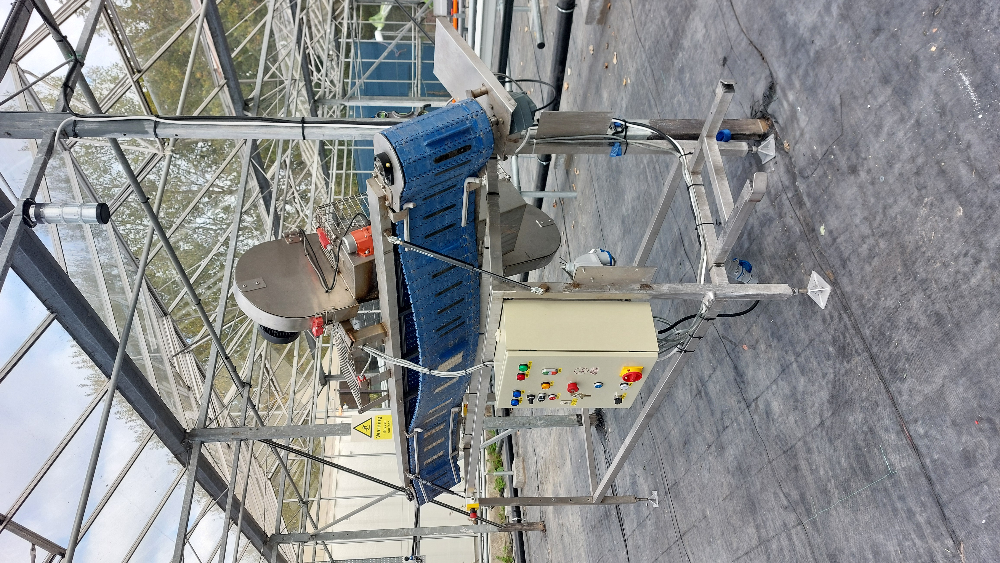
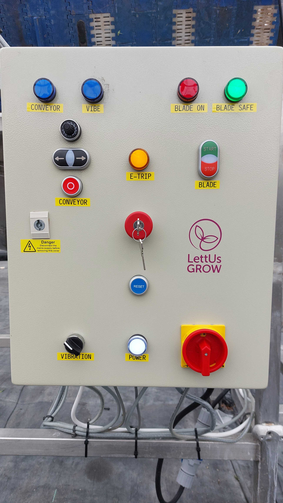
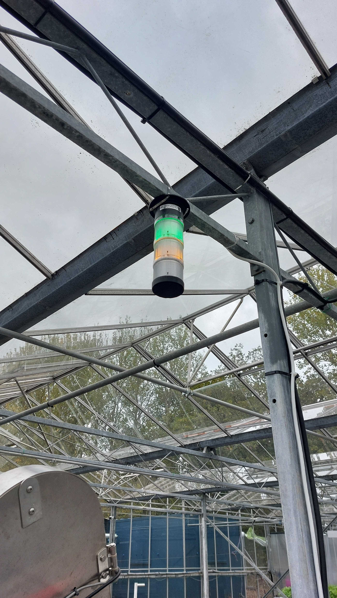
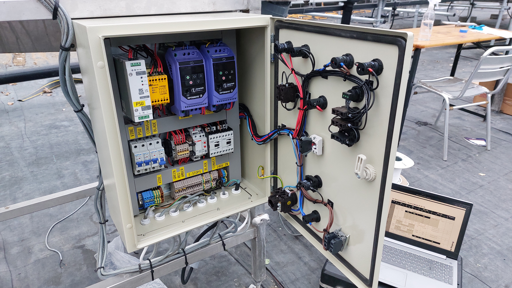
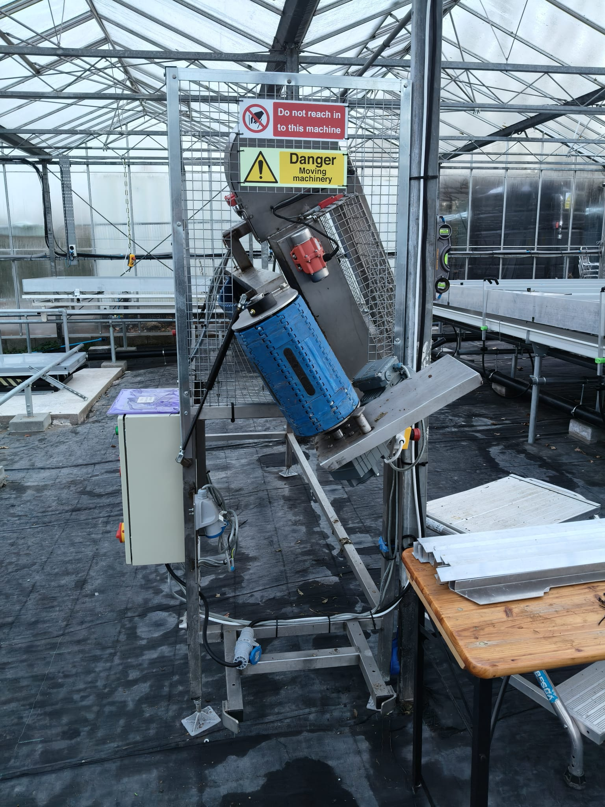
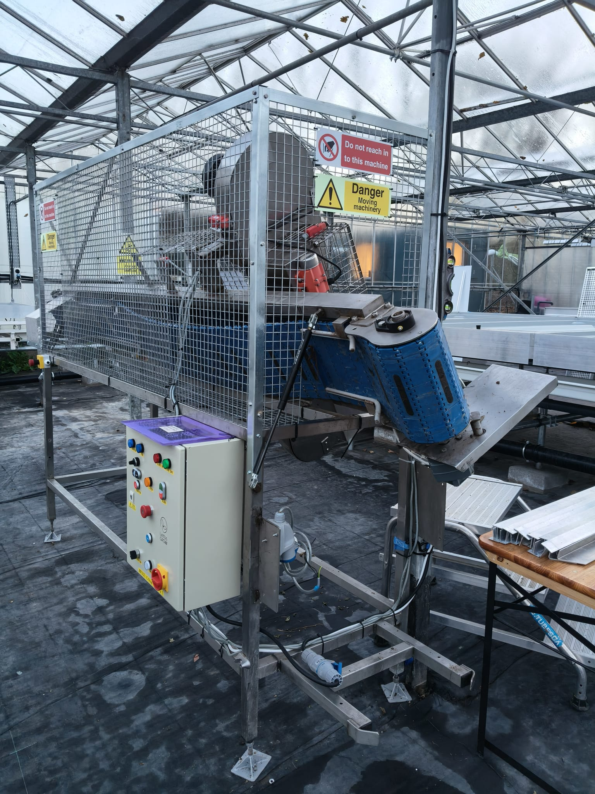
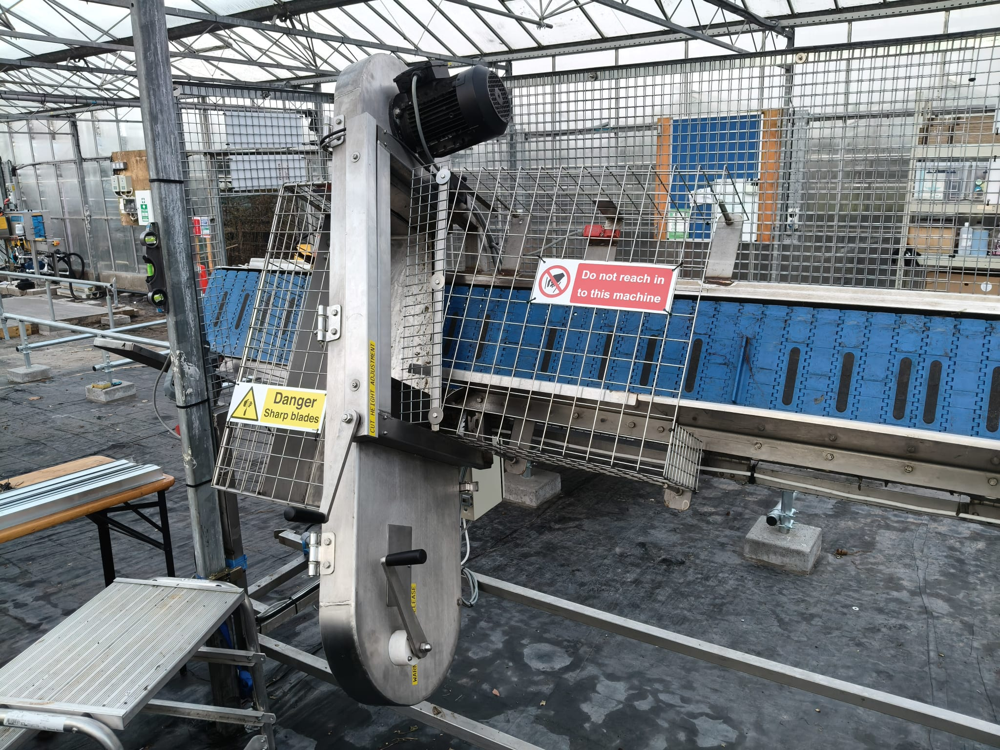
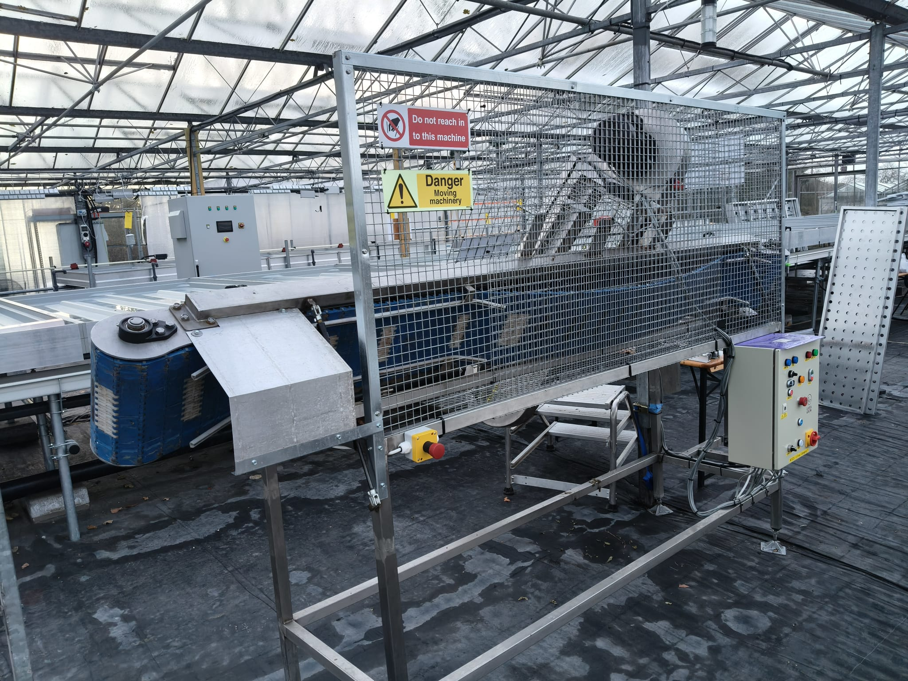

# Harvester Project Documentation

**Project:** Harvester  
**Engineer:** Jon Wheway  
**Date:** 20/10/2025  
**Revision:** V1.5 

---

## 1. Project Brief
The machine, as originally acquired, was a custom-built unit that was not originally designed for crop harvesting. An initial inspection, I determined that the harvester was in an unsafe condition due to its non-standard construction.

## Original Safety Deficiencies Before the recent engineering overhaul, 

The machine presented several critical safety risks:
* **Inadequate Emergency Stops:** The original control panel featured only a single e-Stop on the enclosure door.
* **Dangerous Coast-Down Times:** Pressing the e-Stop simply cuts power via a standard contactor, allowing the blade to coast for up to 15 seconds before coming to a complete stop.
* **Partial System Shutdown:** The original safety circuit failed to isolate other powered components, such as the conveyor belt or vibration plate.
* **Unpredictable system restart:** When the e-Stop was removed, the machine would just restart without requiring a reset button.
* **Physical Hazards:** Insufficient guarding allowed operators to reach into the machine while the blade was exposed.
  
Due to these risks, I decommissioned the machine until comprehensive physical and electrical safety systems could be implemented to meet modern standards.

## 2. Upgraded Electrical & Safety Systems
I designed a custom electrical control panel with an industry-standard E-stop relay and dedicated motor control hardware.

The core design challenge was balancing immediate electrical safety with the requirement for controlled deceleration of the blade during an emergency. Originally, the blade would take around 12-15 seconds to come to a stop. The time now has been dramatically reduced to 2-3 seconds through the implemented solution. This rapid deceleration is achieved by integrating dedicated motor control hardware that utilises DC injection braking. 
 

This vector drives inject DC into the 3-phase motor's stator, creating a stationary magnetic field. As the rotor, which is still spinning due to inertia, cuts through this stationary field, a powerful braking torque is induced, causing the motor to decelerate rapidly and come to a complete stop. 
 

A time-delay relay, triggered by the e-Stop circuit, then ensures the motor controller has adequate time to safely and controllably complete the braking sequence before the final electrical isolation occurs.
 

This entire process categorises the emergency stop as Category 1 according to the (EN/IEC 60204-1) standard, which defines a controlled stop where power remains available to machine actuators (the motor controller) to achieve the stop, before power is subsequently removed.

For enhanced site safety and accessibility, overhead beacons and control panel lights were integrated. These allow users who are hard of hearing to immediately ascertain the machine’s status from a distance.

* Green = Blade is stationary
* Red = Blade is running
* Amber = e-Stop engaged

    

 

* **Safety Coverage:** Extensive coverage is achieved via five accessible E-stop buttons and three mechanical latches on protective cages.
* **Braking System:** Blade stop time was reduced from 15 seconds to 2–3 seconds.
* **Technology:** This uses DC injection braking to create a stationary magnetic field within the motor's stator.
* **Standard:** Categorised as a Category 1 emergency stop (EN/IEC 60204-1).
* **Visual Safety:** Illuminated beacons mounted above the machine and on the main control panel.

### 240v Schematic

### Motor Controllers

### Safety e-Stop relay schematic

### Main Panel pinout

### Power Ratings and Technical Settings
| Part | Voltage (V) | Amps (A) |
| :--- | :--- | :--- |
| 24v PSU | 240 | 2.8  |
| Optidrive ODE-3-120043-1F12 (Blade) | 240 | 7.5  |
| Optidrive ODE-3-120023-1F12 (Conveyor) | 240 | 3.7  |
| Vibration Motor | 240 | 0.250  |
| **Total** | | **14.25 A**  |

### Optidrive ODE-3-120023-1F12 conveyor belt settings
| Power kw | Currentr OP | V-in | Phase in | V-out | Phase out |
| :--   | :--   | :--   | :--   | :--   | :--   |
| 0.37k| 2.3amp| 230v | 1 | 0-230v | 3 |

### Settings
| Parameter | Value | Parameter | Value | Parameter | Value | Parameter | Value |
|-----------|-------|-----------|-------|-----------|-------|-----------|-------|
| P1 | 50 | P8 | 1.75 | P16 | U10-0 | P33 | 0 |
| P2 | 0.0 | P9 | 50 | P17 | 8 | P34 | 0 |
| P3 | 50 | P10 | 1415 | P18 | 0 | P35 | 100 |
| P4 | 0.0 | P11 | 3 | P19 | 100 |  |  |
| P5 | 2 | P12 | 0 | P24 | 2 |  |  |
| P6 | 0 | P13 | 0 | P30 | Ed9E-r |  |  |
| P7 | 230 | P15 | 11 | P32 | 0.0 |  |  |

### Optidrive ODE-3-120043-1F12 blade settings 
| Power kw | Currentr OP | V-in | Phase in | V-out | Phase out |
| :--   | :--   | :--   | :--   | :--   | :--   |
| 0.75k| 4.3amp| 230v | 1 | 0-230v | 3 |

### Settings
| Parameter | Value | Parameter | Value | Parameter | Value | Parameter | Value |Parameter | Value |
|-----------|-------|-----------|-------|-----------|-------|-----------|-------|-------|-------|
| P1 | 25 | P8 | 3.8 | P15 | 15    | P30 | Ed9E-r | P58 | 25.0|
| P2 | 0.0 | P9 | 50 | P16 | U10-0 | P32 | 3,0 |  P59 | 100 |
| P3 | 5 | P10 | 0 | P17 | 8       | P33 | 0 | 
| P4 | 0.2 | P11 | 3 | P18 | 0 |   P34  | 0 |
| P5 | 0 | P12 | 0 | P19 | 100 |   P35  | 100 |
| P6 | 0 | P13 | 0 | P24 | 1.5 |   P38   | 0 |
| P7 | 230 | P14 | 201 | P25 | 8 | P39 | 0.0 |

## Time Delay Relay
The time-delay relay is continuously powered by the 24V PSU via terminals A1 (+24V) and A2 (GND). Upon startup, a +24V holding signal is supplied to terminal B1 from the e-Stop relay, keeping the time-delay relay contacts closed. When the e-Stop circuit is triggered, the +24V signal to B1 is removed, initiating the countdown. After the preset delay of 3 seconds has elapsed, the relay contacts disengage, which de-energises a contactor connected between the blade's Optidrive and the motor, thereby isolating all final power output from the panel to the machine.

### Settings
| State | Time|
|:--- |:--- |
| Mode | sf |
| T    | 10s |
| t:   | 3-4s |

## 3. Operation Guide

### Start-Up
1.  **Main Power:** 
       * Turn on the farm wall isolator, then the harvester's main large red isolator.
2.  **Status Check:** 
       * Green, Amber, and White lights should be illuminated
       * (White) The machine now has power, (Green) the blade is stationary and (Amber) the e-Stop is engaged. 
3.  **Reset:** 
    * Check all cages and all e-Stop buttons and disenguaged and the machine is safe.
    * Turn the key to disenguage main e-Stop button.
    * Press the Reset button. The Amber light will turn off, and the green light should remain on, indicating the machine is ready to operate.

### Machine Operation
* **Vibration:** 
    * Flip the switch to ON (Blue light activates), the vibration motor will start.
* **Conveyor:** 
    * Select the Forward direction on the conveyor belt control.
    * Adjust the speed to the desired level. It's recommended to start with a low speed to prevent the tray from moving through the machine too quickly.
* **Blade:** 
    * Press the Green button to start the blade. 
    * The Red light indicates the blade is moving.

### Restart after e-Stop
1.  Amber light is illuminated! 
2.  Check why the e-Stop was engaged.
3.  If all is safe and the machine can be reset to service, remove the e-stop buttons.
4.  Press the Reset Button, the amber light in go out.
5.  Select the Forward direction on the conveyor belt control.
6.  Adjust the speed to the desired level. It's recommended to start with a low speed to prevent the tray from moving through the machine too quickly.
7.  Press the Green button to start the blade. 
8.  The Red light indicates the blade is moving.
9.  The vibration motor will start automatically.

### Stopping the machine while in service
1.  Press the red stop button on the blade control.
2.  Press the red stop button on the conveyor control.
3.  Flip the vibration switch to the OFF position.

### Shutdown After service
1.  Press the red stop button on the blade control.
2.  Press the red stop button on the conveyor control.
3.  Flip the vibration switch to the OFF position.
4.  Press and engage the main E-stop button on the control panel and remove the key.
5.  Turn off the farm wall isolator.
6.  Remove the key from the e-stop button and lock it in the secure keybox in welfar cabin.

## Machine caging for physical safety

 
